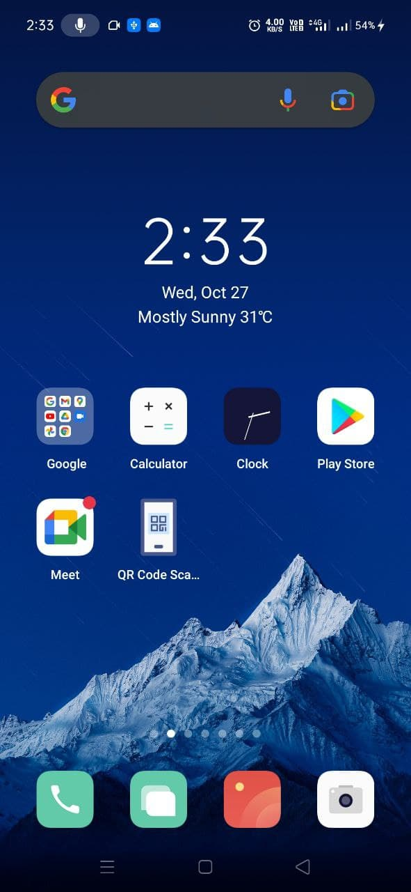
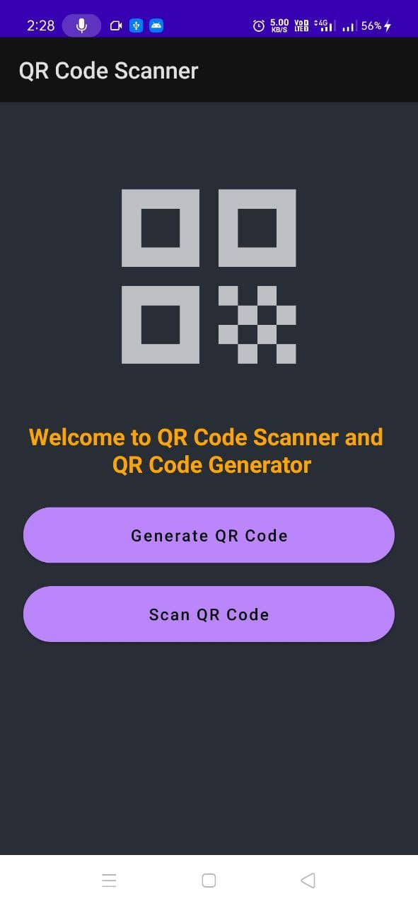
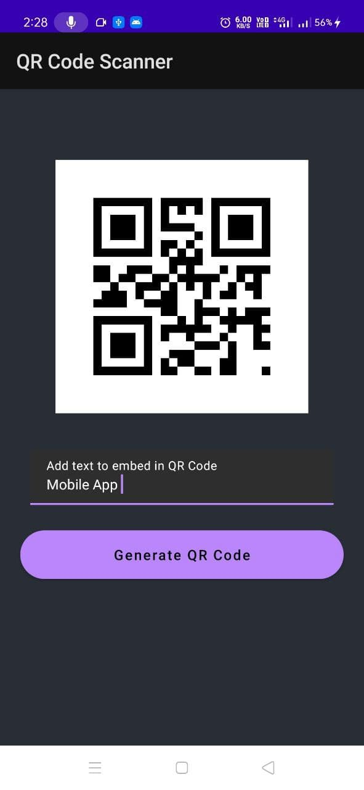
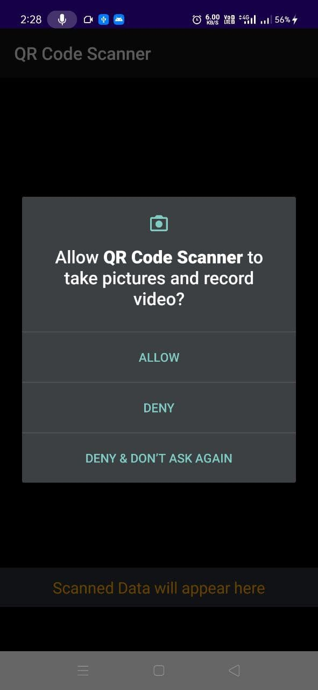

# QRCode-Scanner-and-Generator-

In these project I created a QR-code generator and scanner which will not only able to genrate unique QR code every time but also scan your desired QR code with precision.

•This **Mobile Application** is made on android studio using Java programming language.

•In these app created four activity file for-

•**scanQRcode**- In these activity i used scanner live view  and ZXDecoder() for decoding & scanning the code, checked premission and grant decision to camera and make final toast for message output showing,

•**genrateQRcode**- In these activity, firstly inherited the xml function like buttons,selectors proceed to get text value of genrate qrcode and create bitmap, 

•**main activity**- In this we simply redirected this activity to home activity for initialize first screen, 

•**home activity** where intial input taken from user to select which process to follow such as Genrate QR-code or Scan new one and just intialize the onclicklistner for both activity.

•Also made changes in the manifest file to first open home activity not main activity. 

**App View**

**•Application design(icon)**

**•Application home screen**

**•QRGenerator screen**

**•Permision screen prompt**

**•QRscanner screen**

*For better understanding you can watch my QRcode app videos on my LinkedIn profile -https://www.linkedin.com/in/rajiljain
